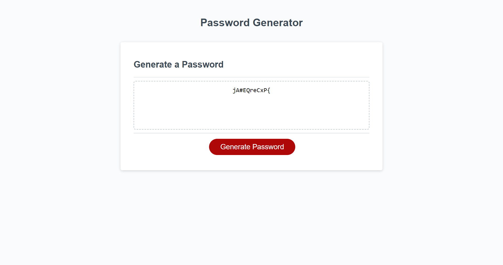

# Title

Password Generator

## Description

This project is a simple password generator application allowing users to create a strong password that provides greater security.

## Screenshots

## Usage

1. Click "Generate Password".
2. Type a number between 8 and 128 into the prompt to choose a password length.
3. Click "OK" for "yes" or "Cancel" for "no" for your password to include the following: 
   - lowercase characters 
   - uppercase characters 
   - numbers
   - special characters
4. Your random password will be generated.

## Link to deployed application

[Deployed application](https://eduardbahrin.github.io/password-generator/)

## Link to GitHub repository

[Github repository](https://github.com/eduardbahrin/password-generator)

